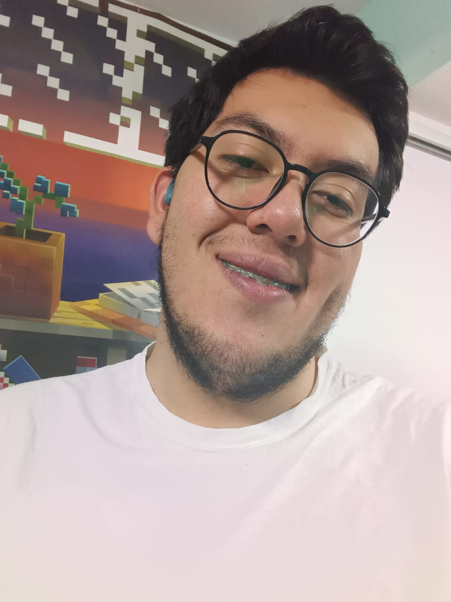

# **Luis Eduardo Lemus Pérez**

Luis Eduardo Lemus Pérez nació el 19 de septriembre de 2004, cumpliendo así los 18 años en 2022 y estando a punto de cumplir 19 en 2023.

---
### Estudio programación y desarrollo de videojuegos porque desde hace tiempo que me gusta la programación y los videojuegos son el **arte** que me deja expresar las historias que quiero contar pero de manera interactiva.   
---
Cuando acabe la carrera espero trabajar sobre todo, como diseñador de videojuegos, ya sea fundando una empresa propia y trabajando también como programador, o en una empresa donde pueda trabajar tanto programando como deseñando niveles y desde la parte creativa y de narración.

**Mis pasatiempos:**

1. Leer (Porque me gusta)
1. Jugar videojuegos (Porque me gusta)
1. Jugar juegos de mesa (Porque me gusta)
1. Salir con mis amigos (Porque me gusta)
1. Ir a clases de filosofía (Porque me ayuda a vivir mejor) 

_Información de contacto:_

- Instagram: @yiztino_developer
- Twitter: @YiztinoDev

