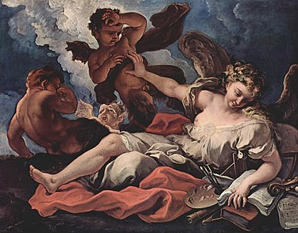

# Esto es un h1
Bienvenidos aquí uwu. **Bem-vindo** Esto es de _italia_. Pero se viene lo bueno _**Mucho indicativo**_
## Esto es un encabezado dos 
### y Así hasta el 6
###### hasta aqui 

Aqui encontraras un enlace a [más información](https://jonmircha.com/markdown), osi, osi

Y esta es una imageeen 

oTRA 

Un bloque de contenido.

---

Otro bloque de contenido.
Listas ordenadas

1. Primavera
1. Verano
1. Otoño
1. Invierno

Listas desordenadas

- Primavera
- Verano
- Otoño
- Invierno

## LISTAS ANIDADAS
- Primavera
  - Abril
  - Mayo
  - Junio
- Verano
  - Julio
  - Agosto
  - Septiembre
- Otoño
  1. Octubre
  1. Noviembre
     - Día de Muertos
     - _Black Friday_
  1. Diciembre
- Invierno
  1. Enero
  1. Febrero
  1. Marzo                                                                                                                                               x

ugfd AHORA Van las **Citas Textuales** 
> Todo lo que escuchamos es una opinión, no un hecho. Todo lo que vemos es una perspectiva, no la verdad. - Marco Aurelio.

> Todo lo que escuchamos es una opinión, no un hecho. Todo lo que vemos es una perspectiva, no la verdad.
>
> Marco Aurelio.

AHORA tablas **_TABLAS_**
| Columna 1 | Columna 2 | Columna 3 |
| -  | --  | - |
| A         | B         | C         |
| D         | E         | F         |
| G         | H         | I         |

```css
function sumar(a,b){
    return a + b
}
```

Esto es `código` en línea.

En _JavaScript_ una variable se define así: `let saludo = "Hola Mundo";`.

```js
function sumar(a, b) {
  if (typeof a !== "number" || typeof b !== "number") {
    console.error(`Los valores ingresados NO son números.`);
    return false;
  }

  let c = a + b;
  return c;
}
```
<form>
  <label for="q">Buscar:</label>
  <input type="search" name="q" id="q" required />
  <input type="submit" value="🔍" />
</form>

<!-- Esto es un comentario -->
Datos personales, fotografia, presentacion, que esperan trabar redes pasatiempos, 

Texto en \_cursiva\_ y \*\*negrita\*\*.